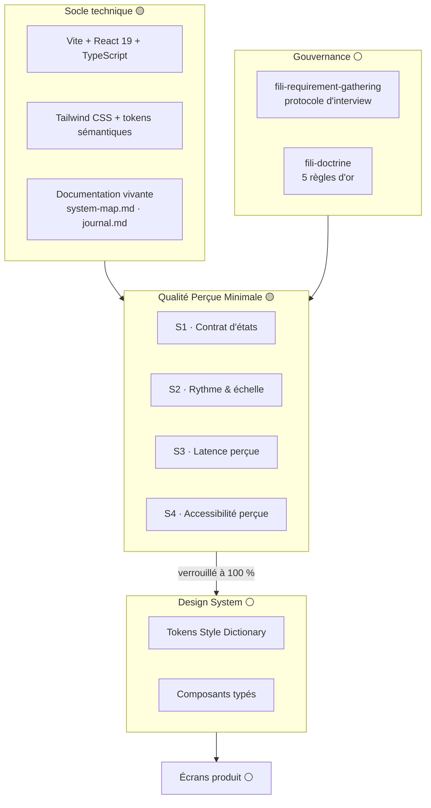

# system-map.md — Carte du système FILI V2

> Document vivant. Source de vérité unique de l'état du système.
> Toute décision qui change cette carte est justifiée dans `journal.md`.

**Légende des statuts**

| Statut | Signification |
|---|---|
| ⚪ | **Idée** — formulée, non instruite. Aucun engagement. |
| 🟡 | **En cours** — instruite, en discussion ou en construction. Réversible. |
| 🟢 | **Verrouillé** — crash-test déterministe passé à 100 %. Ne se rouvre que par une décision explicite tracée au journal. |

**Dernière mise à jour** : 2026-08-06 · dernière décision au journal : `#004`

---

## 1. Vue d'ensemble

**Règle de progression** : aucun passage à la couche suivante tant que la couche
courante n'est pas 🟢. La Qualité Perçue Minimale est le premier verrou.

---

## 2. Sujet en cours — Qualité Perçue Minimale (QPM) 🟡

> *Définition de travail* : le seuil en dessous duquel une interface est perçue
> comme bâclée, indépendamment de son esthétique. La QPM n'est pas du goût,
> c'est un plancher mesurable. En dessous, l'utilisateur perd confiance ;
> au-dessus, le débat redevient un débat de design.

### Les 4 Sujets — découpe actée le 2026-08-06

| # | Sujet | Question à laquelle il répond | Statut |
|---|---|---|---|
| **S1** | **Contrat d'états** | Tout élément qui dépend d'une donnée expose-t-il ses 4 états — Normal, Loading, Error, Empty — sans exception ni écran blanc ? | 🟡 |
| **S2** | **Rythme &amp; échelle** | L'espacement, la typographie et les rayons proviennent-ils tous d'une échelle unique, sans valeur en dur ni cas particulier non tracé ? | 🟡 |
| **S3** | **Latence perçue** | Le système répond-il *visiblement* dans les seuils (< 400 ms rien, > 400 ms skeleton, > 5 s progression) et sans saut de mise en page ? | 🟡 |
| **S4** | **Accessibilité perçue** | Focus toujours visible, parcours clavier complet, contrastes ≥ 4.5:1 / 3:1, `prefers-reduced-motion` respecté ? | 🟡 |

---

## 2 bis. Crash-tests de verrouillage

### Contrat de verrouillage

1. Un test est **binaire** : PASS ou FAIL. Pas de « PASS avec réserve »,
   pas de « acceptable pour l'instant ».
2. Un sujet passe 🟢 quand **100 % de ses tests sont PASS sur 100 % du périmètre**.
   Un seul FAIL laisse le sujet 🟡, et le passage à la couche suivante reste fermé.
3. Un test doit être **reproductible sans jugement** : deux exécutions par deux
   personnes différentes donnent le même verdict.
4. Un test qu'on ne sait pas faire échouer n'est pas un test. Chaque batterie
   comporte au moins un **test de mutation** : on casse volontairement le code,
   le test doit passer au rouge.
5. Le **périmètre** est déclaré avant l'exécution et gelé pendant. On ne rétrécit
   pas le périmètre pour faire passer un test.

**Statut d'exécution au 2026-08-06**

| Sujet | Implémenté | Exécuté | Résultat | Statut |
|---|---|---|---|---|
| **S1** | ⚪ non | non | — | 🟡 (aucun composant au périmètre) |
| **S2** | 🟢 `scripts/qpm-s2.mjs` — T1 à T9 implémentés | **oui** | **8 PASS / 9** — T8 non confirmé | 🟡 |
| **S3** | ⚪ non | non | — | 🟡 (aucune opération async au périmètre) |
| **S4** | 🟡 partiel — `eslint.config.js`, tout en `error` | **oui, partiel** | `eslint .` **0 erreur** · `tsc` **0 erreur** | 🟡 (tests manuels T3–T7 non faits) |

**Il ne manque qu'un test.** S2-T8 (build reproductible) échoue chez moi avec
`EPERM: unlink` — mon pont d'accès au disque interdit la suppression de `dist/`.
C'est un artefact d'outil, pas un défaut du code, mais je ne le requalifie pas
en PASS : le contrat interdit de rétrécir un test pour le faire passer. Une seule
exécution dans un terminal natif tranche.

S1 et S3 n'ont rien à mesurer tant qu'aucun composant ne dépend d'une donnée —
c'est cohérent, le cadre précède la production.

---

### S1 · Contrat d'états — batterie 🟡

**Périmètre** : tout composant dont le rendu dépend d'une donnée non résolue à la
compilation (fetch, mutation, formulaire, permission).

| ID | Assertion binaire | Mesure | Attendu |
|---|---|---|---|
| S1-T1 | Aucun rendu ne dérive d'une conjonction de booléens | Recherche AST/regex de `isLoading &&`, `!error &&`, `data?.length &&` dans le périmètre | **0 occurrence** |
| S1-T2 | L'état est une union discriminée ou une machine XState | Revue de type : le type d'état a un champ discriminant littéral | **100 % du périmètre** |
| S1-T3 | Le `switch` sur l'état est exhaustif, prouvé par le compilateur | Branche `default` avec assertion `never` ; `tsc` doit échouer si un état est ajouté | **tsc = 0 erreur** |
| S1-T4 | Les 4 états sont rendables isolément | Une fixture/story par état, montée sans mock du réseau | **4 rendus par composant** |
| S1-T5 | Aucun état ne produit un rendu muet | Pour chacun des 4 rendus, le DOM contient ≥ 1 nœud texte non vide | **0 rendu vide** |
| S1-T6 | Tout état Error offre une porte de sortie | Le rendu Error contient ≥ 1 élément focusable et activable (réessayer / revenir / contacter) | **100 %** |
| S1-T7 | Empty distingue zero-state et résultat vide | Deux rendus Empty distincts, textes différents | **2 rendus distincts** |
| S1-T8 | *Mutation* — supprimer la branche Loading fait échouer la chaîne | Suppression volontaire d'une branche, exécution de la batterie | **≥ 1 test au rouge** |

---

### S2 · Rythme &amp; échelle — batterie 🟡

**Périmètre** : `src/**` hors `src/index.css` et `tailwind.config.js`, qui sont
les deux seuls lieux autorisés à contenir des valeurs littérales.

| ID | Assertion binaire | Mesure | Attendu |
|---|---|---|---|
| S2-T1 | Aucune couleur littérale | Regex `#[0-9a-fA-F]{3,8}\b`, `rgba?\(`, `hsla?\(` | **0 occurrence** |
| S2-T2 | Aucune dimension littérale | Regex `\d+(px\|rem\|em)\b` dans les fichiers de composants | **0 occurrence** |
| S2-T3 | Aucune durée littérale | Regex `\d+ms\b`, `\d+(\.\d+)?s\b` | **0 occurrence** |
| S2-T4 | Aucune valeur arbitraire Tailwind | Regex `class(Name)?="[^"]*\[[^\]]+\]` — équivalent règle `no-arbitrary-value` | **0 occurrence** |
| S2-T5 | Échelle d'espacement fermée | Extraction des classes `p-* m-* gap-* space-*` ; intersection avec l'échelle déclarée | **100 % dans l'échelle** |
| S2-T6 | Échelle typographique fermée et courte | Comptage des classes `text-*` distinctes sur tout le produit | **≤ 6 tailles distinctes** |
| S2-T7 | Aucun token orphelin | Chaque custom property `--fili-*` déclarée est référencée ≥ 1 fois ; chaque token référencé est déclaré | **0 orphelin, 0 fantôme** |
| S2-T8 | Build reproductible | `npm run build` deux fois → hash SHA-256 du CSS émis | **hash identique** |
| S2-T9 | *Mutation* — injecter `#3B82F6` dans un composant fait échouer S2-T1 | Injection volontaire, exécution | **S2-T1 au rouge** |

---

### S3 · Latence perçue — batterie 🟡

**Périmètre** : toute transition d'état déclenchée par une opération asynchrone.
Latences simulées de façon déterministe (faux timers + throttling réseau fixé),
jamais mesurées « à la main sur ma machine ».

| ID | Assertion binaire | Mesure | Attendu |
|---|---|---|---|
| S3-T1 | Sous le seuil, aucun indicateur ne clignote | Latence simulée 350 ms → recherche d'un skeleton/spinner dans le DOM | **0 indicateur** |
| S3-T2 | Au-delà du seuil, un skeleton apparaît | Latence simulée 1 200 ms → skeleton présent avant 450 ms | **présent, < 450 ms** |
| S3-T3 | Le skeleton occupe la boîte finale | CLS mesuré sur la transition Loading → Normal | **CLS ≤ 0,02** |
| S3-T4 | Au-delà de 5 s, un message d'attente longue apparaît | Latence simulée 6 000 ms → texte de progression présent | **présent** |
| S3-T5 | Le chargement est annoncé | Assertion DOM : `aria-busy="true"` ou région `aria-live="polite"` mise à jour | **100 %** |
| S3-T6 | La fin de chargement est annoncée, pas seulement le début | La région live est mise à jour à l'arrivée des données | **100 %** |
| S3-T7 | Retour visuel immédiat à l'interaction | INP mesuré au p75 sur le parcours de référence | **≤ 200 ms** |
| S3-T8 | *Mutation* — remplacer le skeleton par un spinner de taille nulle fait échouer S3-T3 | Mutation volontaire, mesure du CLS | **S3-T3 au rouge** |

---

### S4 · Accessibilité perçue — batterie 🟡

**Périmètre** : chaque écran **dans chacun de ses 4 états**, et dans les deux
thèmes (clair et sombre). Un écran testé dans son seul état Normal n'est pas testé.

| ID | Assertion binaire | Mesure | Attendu |
|---|---|---|---|
| S4-T1 | Aucune violation automatique sérieuse | `axe-core` sur chaque état × chaque thème, niveaux *serious* et *critical* | **0 violation** |
| S4-T2 | Le lint a11y est propre | `eslint-plugin-jsx-a11y` configuré en `error`, exécution complète | **0 erreur, 0 warning** |
| S4-T3 | Le parcours clavier est complet et ordonné | Tab / Shift+Tab de bout en bout ; l'ordre de tabulation suit l'ordre visuel | **100 %, 0 divergence** |
| S4-T4 | Aucun piège de focus hors modale | Le parcours revient au point de départ sans blocage ; `Échap` ferme toute surcouche | **0 piège** |
| S4-T5 | Le focus est visible partout | À chaque arrêt de S4-T3 : capture, contraste de l'indicateur vs fond adjacent | **≥ 3:1 partout** |
| S4-T6 | Les contrastes de texte sont conformes | Calcul sur tous les couples texte/fond, dans les deux thèmes | **≥ 4,5:1 (≥ 3:1 large et UI)** |
| S4-T7 | Le reflow tient | Rendu à 320 px de large, puis à 200 % de zoom | **0 scroll horizontal, 0 troncature** |
| S4-T8 | Le mouvement réduit est respecté | Sous `prefers-reduced-motion: reduce`, durées d'animation calculées | **0 animation > 0,01 ms** |
| S4-T9 | Chaque contrôle a un nom accessible | Calcul de l'*accessible name* de tout élément interactif | **0 nom vide** |
| S4-T10 | *Mutation* — poser `outline: none` sur un bouton fait échouer S4-T5 | Mutation volontaire, exécution | **S4-T5 au rouge** |

**Note de méthode** : `axe-core` et le lint ne couvrent qu'environ 30 % des
non-conformités (règle d'or n°2). S4-T3, S4-T4, S4-T5 et S4-T7 restent des
vérifications **manuelles scriptables**, pas automatisables au sens strict.
Un sujet S4 déclaré 🟢 sur les seuls tests automatiques serait un faux verrou.

---

## 3. Socle technique 🟡

| Élément | Choix | Statut | Note |
|---|---|---|---|
| Build | Vite 6 | 🟡 | `npm run dev` / `npm run build` |
| Framework | React 19 + TypeScript strict | 🟡 | `strict`, `noUnusedLocals`, `noUnusedParameters` |
| Styles | Tailwind CSS 3.4 | 🟡 | `tailwind.config.js` + directives `@tailwind` |
| Tokens | Custom properties CSS mappées dans Tailwind | 🟡 | Provisoire — cible : Style Dictionary |
| Thème | Clair / sombre via `prefers-color-scheme` | 🟡 | Pas de bascule manuelle pour l'instant |
| Design System | — | ⚪ | Aucun composant typé créé. R1 non encore applicable. |
| Lint a11y | `eslint-plugin-jsx-a11y` | 🟡 | `eslint.config.js` écrit, toutes règles en `error` — non installé |
| Lint tokens | `eslint-plugin-tailwindcss` | 🟡 | `no-arbitrary-value` + `no-custom-classname` en `error` — non installé |
| Test a11y | `axe-core` | ⚪ | Déclaré en devDependency, harness non écrit (pas de composant à tester) |
| Crash-test S2 | `scripts/qpm-s2.mjs` | 🟢 | Zéro dépendance, exécuté, 7 PASS / 1 BLOQUÉ |
| Machine d'états | `xstate` | ⚪ | Pertinent dès S1 |
| Versionnement | `git` | 🟡 | Dépôt initialisé, 1 commit — locks résiduels à purger (D8) |
| Hook pre-commit | `.githooks/pre-commit` | 🟡 | Sans dépendance. Activer : `npm run hooks` |
| Environnement | `.nvmrc` (Node 22) · `.editorconfig` · `engines` | 🟢 | — |
| Intégration continue | GitHub Actions | 🟡 | `.github/workflows/qpm.yml` — seul lieu où S2-T8 s'exécute |
| Protection de branche | GitHub ruleset | ⚪ | À activer à la main (D10) — sans elle, une PR rouge reste fusionnable |
| Runner de tests | `vitest` | ⚪ | Requis pour S1 (fixtures des 4 états) — inutile sans composant |

**Écarts assumés à ce stade**

1. `src/App.tsx` utilise du HTML brut (`main`, `h1`, `section`, `dl`).
   Justifié : aucun Design System n'existe encore. Cet écart est daté et
   disparaît dès la création des premiers composants typés. Tracé au journal.
2. Les tokens vivent dans `src/index.css` et non dans Style Dictionary.
   Justifié : éviter un outil de build tant que l'échelle n'est pas arrêtée (S2).

---

## 4. Documentation vivante 🟢

| Fichier | Rôle |
|---|---|
| `system-map.md` | **Où on en est** — état, statuts, écarts, dettes. Se relit d'un coup d'œil. |
| `journal.md` | **Pourquoi on en est là** — décisions datées, sens produit et UX, alternatives écartées. Ne se réécrit jamais. |

---

## 5. Dettes ouvertes

| # | Dette | Origine | Échéance |
|---|---|---|---|
| ~~D1~~ | ~~Aucune dépendance installée~~ | — | ✅ **Levée** le 2026-08-06 — `npm install` abouti sur `~/Claude/Projects/Fili/fili-v2` |
| D2 | HTML brut dans `App.tsx` | Design System inexistant | Premiers composants typés |
| D3 | Tokens non générés par Style Dictionary | Échelle non arrêtée (S2) | Verrouillage de S2 |
| ~~D4~~ | ~~Chaîne de preuve a11y jamais exécutée~~ | — | ✅ **Levée** le 2026-08-06 — `eslint .` 0 erreur, `tsc -b` 0 erreur |
| D7 | Tests a11y **manuels** S4-T3 à S4-T7 jamais faits (clavier, piège de focus, focus visible, reflow) | Non automatisables — 70 % des non-conformités sont là | Avant le premier écran produit |
| D8 | ~30 fichiers `.lock` / `tmp_obj_*` résiduels dans `.git/` — **bloquent le prochain commit** | `git init` lancé depuis le pont, qui interdit `unlink` | `find .git \( -name "*.lock" -o -name "tmp_obj_*" \) -delete` |
| D9 | L'écosystème Fili (19 dépôts + 2 skills) **n'est pas sur la machine d'Aurélien** — il vit dans un conteneur cloud éphémère | Registre npm et `~/.claude` hors de portée depuis le cloud | `bash ~/Claude/Projects/Fili/setup_fili.sh` |
| D10 | La CI existe mais **ne bloque rien** — sans branch ruleset, une PR rouge reste fusionnable | Réglage côté GitHub, hors dépôt | Settings → Branches → ruleset (cf. README) |
| D5 | Les 4 batteries de crash-tests sont écrites mais **jamais exécutées** | Outillage absent (D4) + aucun composant au périmètre | Au premier composant produit |
| D6 | Les seuils chiffrés (CLS ≤ 0,02 · ≤ 6 tailles typo · INP ≤ 200 ms) sont posés par défaut, pas éprouvés | Aucune mesure de référence disponible | Première exécution réelle des batteries |
